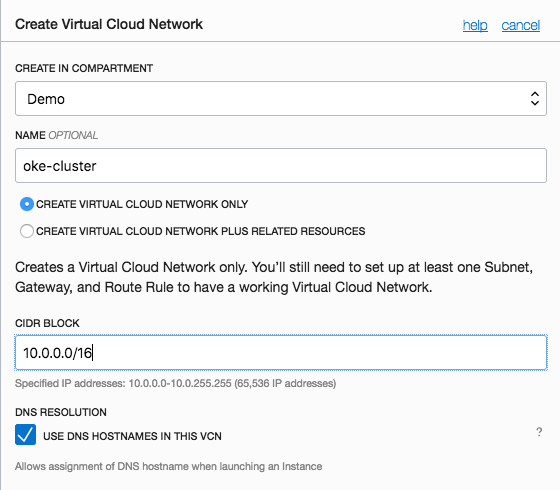
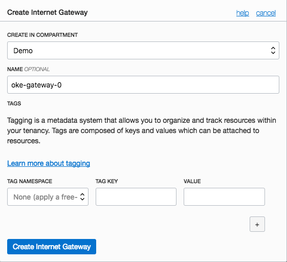
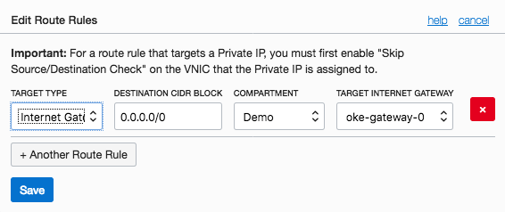
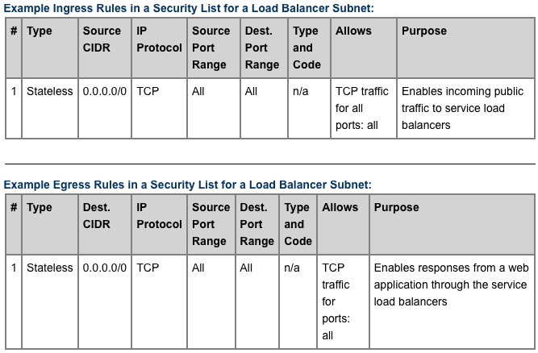
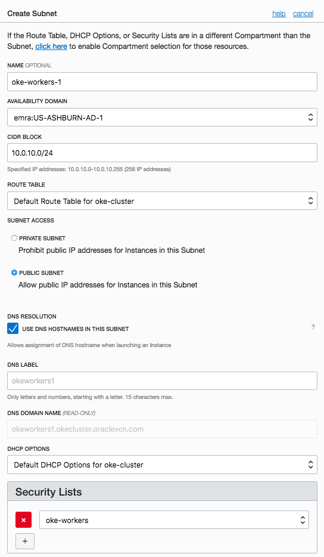

# Provision an Oracle Container Engine for Kubernetes

## Preparing Container Engine for Kubernetes

Before you can use Container Engine for Kubernetes to create a Kubernetes cluster:

- You must have access to an Oracle Cloud Infrastructure tenancy

- Your tenancy must have sufficient quota on different types of resource
  - at least one compute instance (node) must be available in the tenancy or three compute instances (one in each availability domain) to create a highly available cluster
  - at least one load balancer to distribute traffic between the nodes running a service in a Kubernetes cluster

- A suitably pre-configured compartment must already exist in each region in which you want to create and deploy clusters. If you are using a GSE environment, then you should use the **Demo** compartment and **api.user** as the local OCI login account.
  - The compartment must contain the necessary network resources already configured (VCN, subnets, internet gateway, route table, security lists) before you can create and deploy a cluster. For example, to create a highly available cluster spanning three availability domains, the VCN must include three subnets in different availability domains for node pools, and two further subnets for load balancers.
 
- Within the root compartment of your tenancy, a policy statement (allow service OKE to manage all-resources in tenancy) must be defined to give Container Engine for Kubernetes access to resources in the tenancy.

- To create and/or manage clusters, you must belong to one of the following (**api.user** if using GSE environment):
  - The tenancy's Administrators group
  - A group to which a policy grants the appropriate Container Engine for Kubernetes permissions
  
- To perform operations on a cluster:
  - You must have installed and configured the Kubernetes command line tool `kubectl`
  - You must have downloaded the cluster's `kubeconfig` file

The following steps illustrates how you can do the above.

### **STEP 1**: Create Policy for Container Engine

To create and manage clusters in your tenancy, Container Engine must have access to all resources in the tenancy. To give Container Engine the necessary access, create a policy for the service as follows:

- In the Console, click **Identity**, and then click **Policies**. A list of the policies in the compartment you're viewing is displayed.

- Select the tenancy's **root** compartment from the list on the left

- Click **Create Policy**

- Enter the following:
  - **Name:** `oke-service`
  - **Description:** `allow OKE to manage all-resources in tenancy`
  - **Policy Versioning:** Select **Keep Policy Current**, select **Use Version Date** and enter that date in YYYY-MM-DD format.
  - **Statement:** The following policy statement:
  `allow service OKE to manage all-resources in tenancy`

- Leave the rest to default

- Click **Create**

### **STEP 2**: Configuring Network Resources

You must create a VCN for your cluster and it must include the following:

  - The VCN must have a CIDR block defined that is large enough for at least five subnets, in order to support the number of hosts and load balancers a cluster will have
  - The VCN must have an internet gateway defined
  - The VCN must have a route table defined that has a route rule specifying the internet gateway as the target for the destination CIDR block
  - The VCN must have five subnets defined, three subnets in which to deploy worker nodes and two subnets to host load balancers.

## **STEP 2.1**: VCN Configuration

- In the Console, click **Networking**, and then click **Virtual CLoud Network**

- Select your the tenancy's **Demo** compartment (for GSE env) from the list on the left

- Click **Create Virtual Cloud Network**

- Enter the following:
  - **Name:** `oke-cluster`
  - **CIDR Block:** `10.0.0.0/16`
  - **DNS Resolution:** Check box to **USE DNS HOSTNAMES IN THIS VCN**

- Leave the rest to default (Compartment defaults to **Demo** for GSE env)

- Click **Create Virtual Cloud Network**

## **STEP 2.2**: Internet Gateway Configuration

The VCN must have an internet gateway. The internet gateway must be specified as the target for the destination CIDR block 0.0.0.0/0 in a route rule in a route table.

Once the **oke-cluster** VCN is created

- Click on the **oke-cluster** VCN to enter the details page

- Select **Internet Gateways** from the list on the left

- Enter the following:
  - **Name:** `oke-gateway-0`

- Leave the rest to default (Compartment defaults to **Demo** for GSE env)

- Click **Create Internet Gateway**

## **STEP 2.3**: Route Table Configuration: 

The VCN must have a route table. The route table must have a route rule that specifies an internet gateway as the target for the destination CIDR block 0.0.0.0/0.

- Select **Route Tables** from the list on the left

A `Default Route Table for oke-cluster` should have been created for you, similar to below.

If a default Route Table has not been created for you, then create a new Route Table.

- Click **Create Route Table**

- Enter the following:
  - **Name:** `routetable-0`
  - **Destination CIDR block:** `0.0.0.0/0`
  - **Target Type:** `Internet Gateway`
  - **Target Internet Gateway:** `oke-gateway-0`

- Leave the rest to default (Compartment defaults to **Demo** for GSE env)

- Click **Create Route Table**

However, if a default Route Table has been created, then you only need to add a new rule to the Route Table.

- Click on the **Default Route Table for oke-cluster** (default generated name) Route Table to enter the details page

- Click on **Edit Route Rules**

- Enter the following:
  - **Destination CIDR block:** `0.0.0.0/0`
  - **Target Type:** `Internet Gateway`
  - **Target Internet Gateway:** `oke-gateway-0`

## **STEP 2.4**: DHCP Options Configuration

The VCN must have a DHCP Options configured. The default value for DNS Type of Internet and VCN Resolver is acceptable.

- While still in the VCN `oke-cluster` details page, select **DHCP Options** from the list on the left

A `Default DHCP Options for oke-cluster` should have been created for you, similar to below.

## **STEP 2.5**: Security List Configuration

The VCN must have security lists defined for the Worker Node Subnets and the Load Balancer Subnets. Two security lists need to be created (in addition to the default security list) to control access to and from the worker node subnets and load balancer subnets. The two security lists are named **oke-workers** and **oke-loadbalancers** respectively.

Create two additional security lists to the default `Default Security List for oke-cluster`
  - **Security List Name:** `oke-workers`
  - **Security List Name:** `oke-loadbalancers`
  
There are two types of rules, Ingress and Egress, for both Workers and Load Balancer security lists. There 12 rules in total for the Worker Node Subnet and two rules in total for the Load Balancer Subnet.

Let's create the security lists and rules.

- Select **Security** from the list on the left

There should be one default security list `Default Security List for oke-cluster` similar to below.

### **STEP 2.5.1**: Create Security List for Work Node Subnets

- Click **Create Security Lists**

- Enter the following for first Ingress rule for **oke-worker** security list name:
  - **Security List Name:** `oke-workers`
  - **Source CIDR:** `10.0.10.0/24`
  - **IP Protocol:** `TCP`
  - **Source Port Range:** `ALL`
  - **Destination Port Range:** `ALL`

- Enter the rest of the Ingress rules following the table below:

- Before clicking on **Create Security List** button to complete, you need to enter the Ergress rules as well.

- Enter the rest of the Engress rules following the table below:

- Click on **Create Security List** button to complete

### **STEP 2.5.2**: Create Security List for Load Balancer Subnets

- Repeat Step 2.5.1 for the Load Balancer subnet using the rules below:

You should now have three security lists similar to below:

## **STEP 2.6**: Subnet Configuration

We usually require five subnets in the VCN to create and deploy clusters in a highly available configuration. The following configuration assumes you will be deploying across all three Availability Domains.

  - Three subnets in which to deploy worker nodes. Each worker node subnet must be in a different availability domain. The worker node subnets must have different security lists to the load balancer subnets.
  
  - Two subnets to host load balancers. Each load balancer subnet must be in a different availability domain. The load balancer subnets must have different security lists to the worker node subnets.
  
- Still in the VCN page, select **Subnets** from the list on the left

- Click **Create Subnet**

- Enter the following for the first subnet:
  - **Name:** `oke-workers-1`
  - **Availability Domain:** `emra:US-ASHBURN-AD-1`
  - **CIDR Block:** `10.0.10.0/24`
  - **Route Table:** `Default Route Table for oke-cluster`
  - **Public Subnet:** `Allow public IP addresses for instances in this Subnet`
  - **DNS Resolution:** `Use DNS Hostnames In This Subnet`
  - **DHCP Options:** `Default DHCP Options for oke-cluster`
  - **Security Lists:** `oke-workers`

- Click **Create**

- Repeat the above for the remaining two worker subnets **oke-workers-2** and **oke-workers-3** as below:

- Repeat the above for the two load balancer subnets as below:

### **STEP 3**: Create a Cluster
  
  
- In the Console, click **Clusters**, and select the tenancy's **Demo** compartment from the list on the left

- Click **Create Cluster**

- Enter the following:
  - **Name:** `oke-service`
  - **Description:** `allow OKE to manage all-resources in tenancy`
  - **Policy Versioning:** Select **Keep Policy Current**, select **Use Version Date** and enter that date in YYYY-MM-DD format.
  - **Statement:** The following policy statement:
  `allow service OKE to manage all-resources in tenancy`

- Leave the rest to default

- Click **Create**

