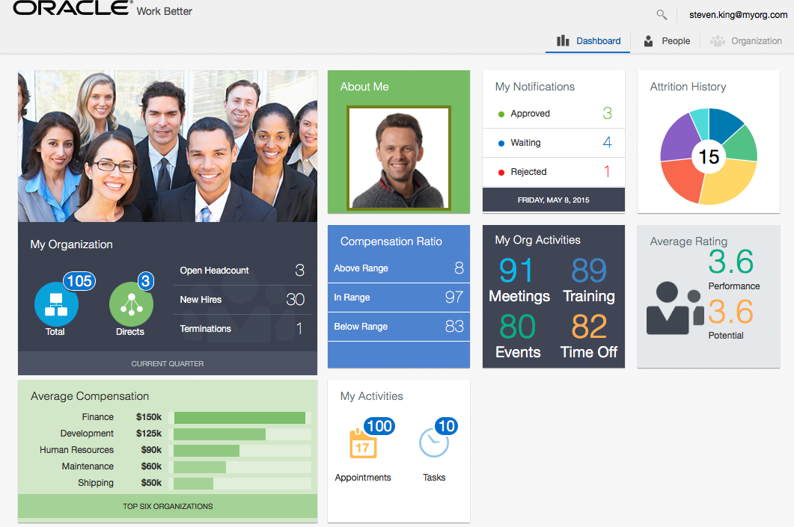
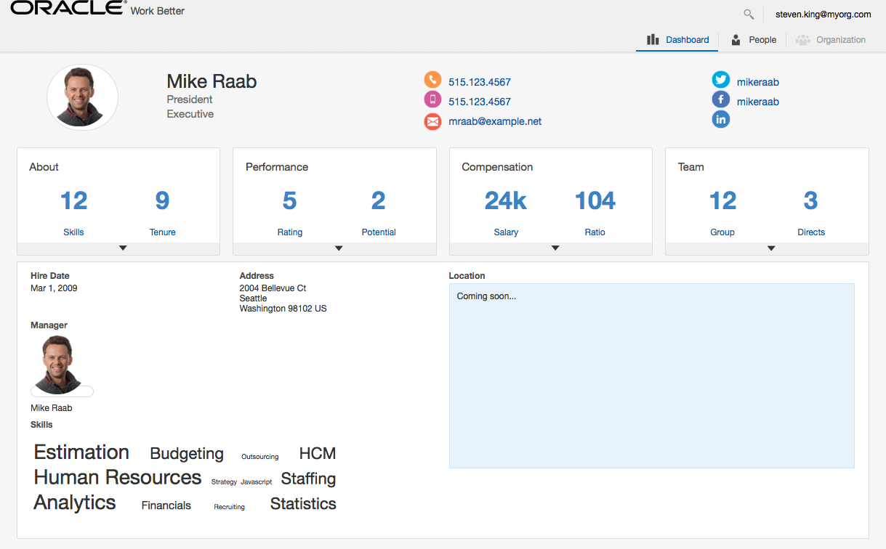
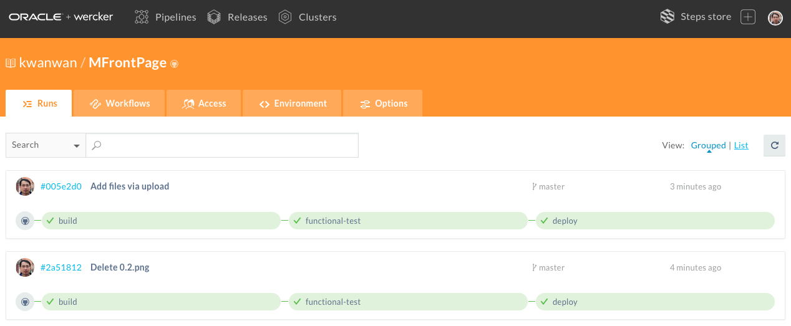
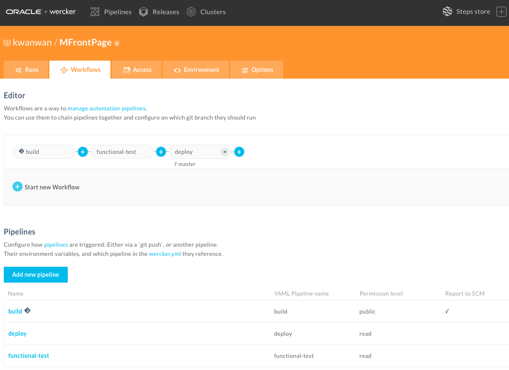
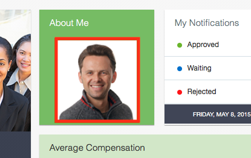

# CI/CD Demo - Wercker Container Pipeline

## Demo Introduction

This repository contains the code for the WorkBetter application demo. This demo will walk you through the process of developing an existing application in a containerised CI/CD pipeline and deploying it to a Kubernetes cluster running on Oracle Cloud Infrastructure.

You will take on the role of a developer, responsible for configuring the automated build and deploy process that involve details about the application itself. To containerise and automate the building and deploying of this application you will make use of Wercker Pipelines, Oracle Container Registry, and Oracle Cloud Infrastrastructure. The Kubernetes infrastructure will be configured and provisioned through Terraform Installer.

On every pipeline execution, the code goes through the following steps:

1. Code is pulled from Github, built, tested and deployed to Kubernetes
2. The Docker image is pushed to the internal Oracle Container Registry
3. The application is then tested
3. If passed, the image will be pulled from the registy and deployed to the Kubernetes cluster

## Time to Complete

Approximately 20 minutes

## Scenario

You are an application developer who is developing a brand new container native HR application using JET for building the web application to be used in a browser from a mobile phone up to desptop. This web application is designed as a microservice to run in a Docker container and deployed over Kubenetes.

The reason why you want to adopt a container native approach has partially been driven by the need to go to market quicker, by delivering new features more frequently, but also more reliably. And you are able to do this by developing Microservices that has less dependencies on other services, as well as the footprint being smaller, easier to deploy and starts up faster. What’s also attractive with Microservices is that you can use the best programming language for the job. To be able to deliver this new style of container native application approach, you will need to adopt the Agile development practice to continuously integrate and deliver these services and features. The application basically consists of the user interfact that is built using Oracle JET framework, packaged as a Docker image and deployed to a Kubernetes cluster hosted on Oracle Cloud Infrastructure.

You will use Wercker (Oracle Container Pipeline) as the core CI/CD software lifecycle management tool for your Agile development and DevOps pipeline. The WorkBetter application has already been created in Wercker with the Workflow and Pipelines created. This demo assumes you have a GitbHub and Wercker accounts and Brackets installed locally on your laptop. You must also have a provisioned Kubernetes cluster on Oracle Cloud Infrastructure.

## What You Need?

- GitHub account
- Wercker account
- Oracle Cloud Infrastructure
- A Kubernetes cluster running on OCI
- An installation of Brackets with Bracket Git by Martin Zagora extension installed
- Some familiarity with GitHub
- Some familiarity with Wercker
- Some familiarity with Brackets

### **Step 1**: Introduce the Work Better application

Work Better is a HR web application written in JET. This web application is designed as a microservice to run in a Docker container and deployed over Kubenetes. It is continuously integrated and developer with Wercker and deployed to a Kubernetes cluster running on OCI.

### **Step 2**: Introduce Wercker (Oracle Container Pipeline)

Wercker is the next generation container lifecycle management tool. You can create Pipelines that enable full build, test and deployment workflows to execute. It supports Docker-native continuous integration and delivery of microservices and functions with a full set of collaboration tools. And Releases are deployed and managed through Kubernetes and built-in Container Registry Service. So that container images are stored and shared across multiple deployments on Oracle Cloud with our private registry. You can also operate Kubernetes deployments to manage and monitor production applications; scale up and scale down your clusters - secure and load balanced.

Also explain about the GitHub repository was added to the workflow when the application is created in Wercker.

### **Step 3**: Walkthrough the WorkBetter workflow

A Workflow in Wercker is how the automation of pipelines are managed. You can interconnect multiple pipelines together to forma workflow. A pipeline can trigger by a GitHub push or by the previous pipeline.

Explain each pipleine in the workflow:

* The **build** pipeline is created by default and it is triggered whenever a commit is made to the GitHub repo or by a GitHub push.
* The **functional-test** pipeline is triggered by a successful build.
* The **deploy** pipeline is triggered by a successful functional test with a condition for changed made to the **_master_** branch only. This enables the testing of code in a new branch before being merged into the master for release.

### **Step 4**: Demostrate a code change

